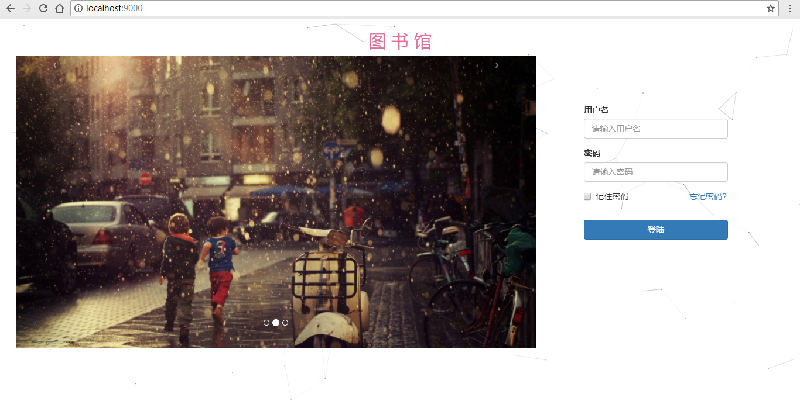
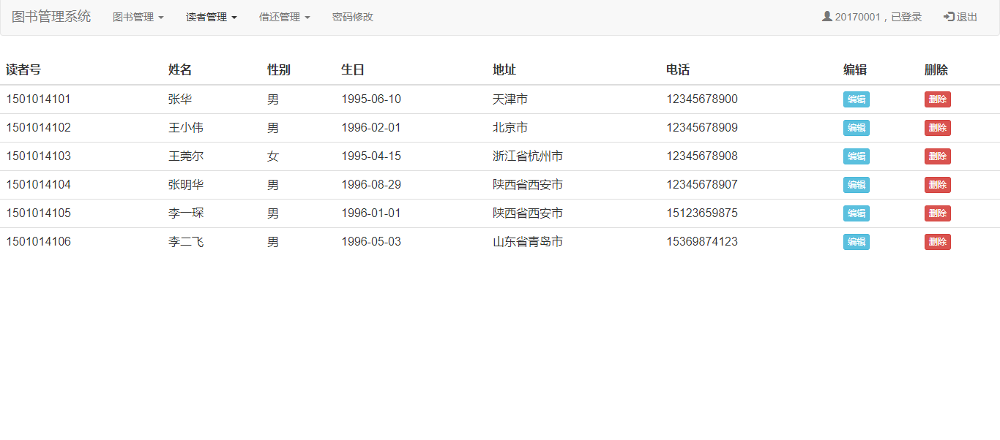
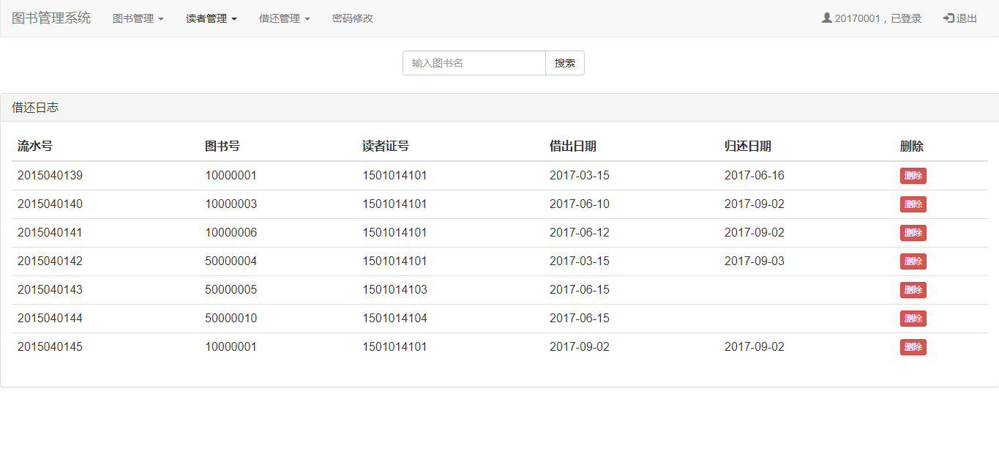
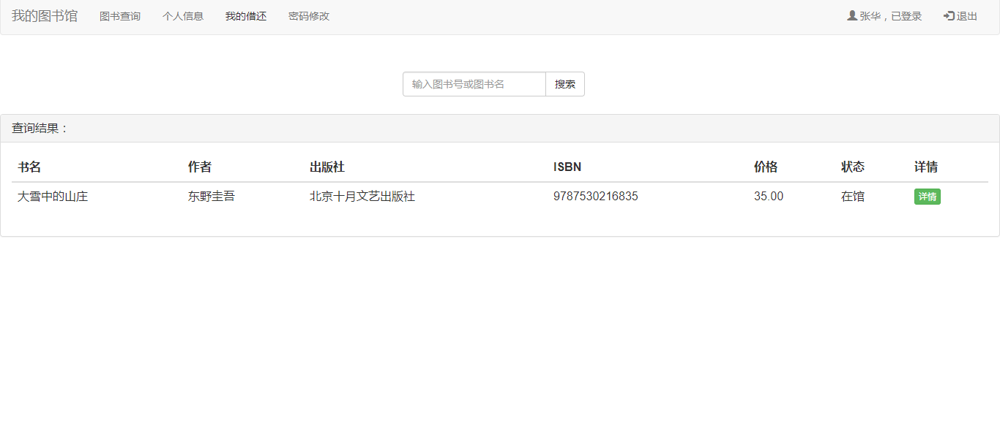

# 软件编码与实现-第四章

## 第四章 编码与实现

### 4.1 编码语言和环境

#### 4.1.1 前端编码语言和环境

**技术栈概述**
图书管理系统前端采用传统的JSP + Bootstrap + jQuery技术栈，实现响应式Web界面。

**编程语言**
- **JSP (JavaServer Pages)**：用于构建动态Web页面
  - 版本：Servlet 3.0 规范
  - 编码：UTF-8
  - 标签库：JSTL 1.2

- **HTML5**：页面结构标记语言
  - 语义化标签使用
  - 响应式设计支持

- **CSS3**：样式表语言
  - 使用Bootstrap框架进行样式管理
  - 自定义样式补充

- **JavaScript**：客户端脚本语言
  - jQuery 3.2.1：DOM操作和事件处理
  - Bootstrap JS：UI组件交互

**开发环境配置**

```xml
<!-- 前端资源依赖配置 -->
<!-- Bootstrap CSS框架 -->
<link rel="stylesheet" href="css/bootstrap.min.css">

<!-- jQuery JavaScript库 -->
<script src="js/jquery-3.2.1.js"></script>

<!-- Bootstrap JavaScript组件 -->
<script src="js/bootstrap.min.js"></script>

<!-- JSTL标签库 -->
<%@taglib prefix="c" uri="http://java.sun.com/jsp/jstl/core" %>
```

**前端架构特点**
- **响应式设计**：基于Bootstrap栅格系统，支持多设备适配
- **模块化布局**：统一的导航栏、面板布局
- **交互体验**：表单验证、模态框、下拉菜单等组件
- **视觉设计**：简洁现代的Material Design风格

**浏览器兼容性**
- Chrome 60+
- Firefox 55+
- Safari 10+
- IE 11+

#### 4.1.2 后端编码语言和环境

**技术栈概述**
采用经典的Spring MVC三层架构，使用Java作为主要开发语言。

**编程语言**
- **Java**：主要开发语言
  - 版本：JDK 1.8
  - 编码：UTF-8
  - 编译目标：Java 8

**核心框架**
- **Spring Framework 4.2.2**：依赖注入和AOP支持
  - spring-beans：Bean管理
  - spring-context：应用上下文
  - spring-webmvc：MVC框架
  - spring-jdbc：数据库访问

- **Maven 构建工具**：项目依赖管理和构建

**开发环境配置**

```xml
<!-- Maven依赖配置 -->
<properties>
    <maven.compiler.source>1.8</maven.compiler.source>
    <maven.compiler.target>1.8</maven.compiler.target>
    <spring.version>4.2.2.RELEASE</spring.version>
    <mysql.version>5.1.29</mysql.version>
</properties>

<!-- 核心依赖 -->
<dependencies>
    <!-- Spring MVC -->
    <dependency>
        <groupId>org.springframework</groupId>
        <artifactId>spring-webmvc</artifactId>
        <version>${spring.version}</version>
    </dependency>
    
    <!-- MySQL数据库驱动 -->
    <dependency>
        <groupId>mysql</groupId>
        <artifactId>mysql-connector-java</artifactId>
        <version>${mysql.version}</version>
    </dependency>
    
    <!-- 连接池 -->
    <dependency>
        <groupId>commons-dbcp</groupId>
        <artifactId>commons-dbcp</artifactId>
        <version>1.4</version>
    </dependency>
</dependencies>
```

**数据库环境**
- **MySQL 5.7+**：关系型数据库
- **连接池**：Apache Commons DBCP
- **字符集**：UTF-8

**部署环境**
- **Web容器**：Jetty 9.4（开发环境）/ Tomcat 8+（生产环境）
- **JVM参数**：-Xmx512m -Xms256m -Dfile.encoding=UTF-8

**开发工具**
- **IDE**：IntelliJ IDEA / Eclipse
- **构建工具**：Maven 3.6+
- **版本控制**：Git

### 4.2 实现效果

基于实际项目运行，以下展示各功能模块的实现效果和操作说明。

#### 4.2.1 系统登录功能

**功能描述**
系统提供统一的登录入口，支持管理员和读者两种角色登录。

**操作步骤**
1. 访问系统首页 `http://localhost:9000`
2. 在登录表单中输入用户名和密码
3. 系统验证身份信息
4. 根据用户角色跳转到相应主页

**界面展示**


**技术实现要点**
```java
@RequestMapping(value = "/api/loginCheck", method = RequestMethod.POST)
public @ResponseBody Object loginCheck(HttpServletRequest request){
    int id = Integer.parseInt(request.getParameter("id"));
    String passwd = request.getParameter("passwd");
    
    boolean isReader = loginService.hasMatchReader(id, passwd);
    boolean isAdmin = loginService.hasMatchAdmin(id, passwd);
    
    HashMap<String, String> res = new HashMap<String, String>();
    if (isAdmin) {
        Admin admin = new Admin();
        admin.setAdminId(id);
        request.getSession().setAttribute("admin", admin);
        res.put("stateCode", "1");
        res.put("msg", "管理员登陆成功！");
    } else if (isReader) {
        ReaderCard readerCard = loginService.findReaderCardByUserId(id);
        request.getSession().setAttribute("readercard", readerCard);
        res.put("stateCode", "2");
        res.put("msg", "读者登陆成功！");
    } else {
        res.put("stateCode", "0");
        res.put("msg", "账号或密码错误！");
    }
    return res;
}
```

**前端表单验证**
```javascript
$("#loginForm").submit(function(e) {
    var username = $("#id").val();
    var password = $("#passwd").val();
    
    if(username == "" || password == "") {
        alert("用户名和密码不能为空");
        return false;
    }
    return true;
});
```

#### 4.2.2 管理员主界面

**功能描述**
管理员登录成功后进入系统主控制台，提供图书管理、读者管理、借阅管理等功能入口。

**界面特色**
- 响应式导航栏设计
- 下拉菜单分类管理
- 系统欢迎提示
- 安全退出机制

**界面展示**


**导航栏实现**
```jsp
<nav class="navbar navbar-default" role="navigation">
    <div class="container-fluid">
        <div class="navbar-header">
            <a class="navbar-brand" href="admin_main.html">图书管理系统</a>
        </div>
        <div class="collapse navbar-collapse">
            <ul class="nav navbar-nav navbar-left">
                <!-- 图书管理下拉菜单 -->
                <li class="dropdown">
                    <a href="#" class="dropdown-toggle" data-toggle="dropdown">
                        图书管理 <b class="caret"></b>
                    </a>
                    <ul class="dropdown-menu">
                        <li><a href="allbooks.html">全部图书</a></li>
                        <li class="divider"></li>
                        <li><a href="book_add.html">增加图书</a></li>
                    </ul>
                </li>
                <!-- 读者管理下拉菜单 -->
                <li class="dropdown">
                    <a href="#" class="dropdown-toggle" data-toggle="dropdown">
                        读者管理 <b class="caret"></b>
                    </a>
                    <ul class="dropdown-menu">
                        <li><a href="allreaders.html">全部读者</a></li>
                        <li class="divider"></li>
                        <li><a href="reader_add.html">增加读者</a></li>
                    </ul>
                </li>
                <!-- 借还管理 -->
                <li class="dropdown">
                    <a href="#" class="dropdown-toggle" data-toggle="dropdown">
                        借还管理 <b class="caret"></b>
                    </a>
                    <ul class="dropdown-menu">
                        <li><a href="lendlist.html">借还日志</a></li>
                    </ul>
                </li>
            </ul>
            <ul class="nav navbar-nav navbar-right">
                <li><a href="login.html">
                    <span class="glyphicon glyphicon-user"></span>
                    &nbsp;${admin.adminId}，已登录
                </a></li>
                <li><a href="logout.html">
                    <span class="glyphicon glyphicon-log-in"></span>
                    &nbsp;退出
                </a></li>
            </ul>
        </div>
    </div>
</nav>
```

#### 4.2.3 图书管理功能

**功能描述**
提供图书信息的完整生命周期管理，包括添加、查询、编辑、删除和借阅状态管理。

**操作说明**
1. **查看所有图书**：点击"图书管理" → "全部图书"
2. **搜索图书**：在搜索框输入关键字进行模糊查询
3. **添加图书**：点击"增加图书"填写图书详细信息
4. **编辑图书**：点击图书列表中的"编辑"按钮
5. **删除图书**：点击"删除"按钮确认删除
6. **借阅管理**：根据图书状态进行借阅或归还操作

**界面展示**


**图书列表实现**
```java
@RequestMapping("/allbooks.html")
public ModelAndView allBook(){
    ArrayList<Book> books = bookService.getAllBooks();
    ModelAndView modelAndView = new ModelAndView("admin_books");
    modelAndView.addObject("books", books);
    return modelAndView;
}
```

**前端表格展示**
```jsp
<div class="panel panel-default">
    <div class="panel-heading">
        <h3 class="panel-title">全部图书</h3>
    </div>
    <div class="panel-body">
        <table class="table table-hover">
            <thead>
                <tr>
                    <th>书名</th>
                    <th>作者</th>
                    <th>出版社</th>
                    <th>ISBN</th>
                    <th>价格</th>
                    <th>状态</th>
                    <th>操作</th>
                </tr>
            </thead>
            <tbody>
                <c:forEach items="${books}" var="book">
                    <tr>
                        <td>${book.name}</td>
                        <td>${book.author}</td>
                        <td>${book.publish}</td>
                        <td>${book.isbn}</td>
                        <td>${book.price}</td>
                        <td>
                            <c:if test="${book.state==1}">
                                <span class="label label-success">可借阅</span>
                            </c:if>
                            <c:if test="${book.state==0}">
                                <span class="label label-danger">已借出</span>
                            </c:if>
                        </td>
                        <td>
                            <a href="bookdetail.html?bookId=${book.bookId}">
                                <button type="button" class="btn btn-success btn-xs">详情</button>
                            </a>
                            <a href="updatebook.html?bookId=${book.bookId}">
                                <button type="button" class="btn btn-info btn-xs">编辑</button>
                            </a>
                            <a href="deletebook.html?bookId=${book.bookId}">
                                <button type="button" class="btn btn-danger btn-xs">删除</button>
                            </a>
                        </td>
                    </tr>
                </c:forEach>
            </tbody>
        </table>
    </div>
</div>
```

**图书搜索功能**
```javascript
$("#searchform").submit(function () {
    var val = $("#search").val();
    if(val == '') {
        alert("请输入关键字");
        return false;
    }
});
```

#### 4.2.4 读者管理功能

**功能描述**
管理系统中的读者信息，包括读者注册、信息维护、读者卡管理等功能。

**操作说明**
1. **查看读者列表**：显示所有注册读者信息
2. **添加读者**：填写读者基本信息和借书证信息
3. **编辑读者信息**：修改读者个人资料
4. **删除读者**：移除读者账户（需确认借书状态）

**界面展示**


**读者添加功能实现**
```java
@RequestMapping("reader_add_do.html")
public String readerInfoAddDo(String name, String sex, String birth, 
                             String address, String telcode, int readerId,
                             RedirectAttributes redirectAttributes){
    SimpleDateFormat sdf = new SimpleDateFormat("yyyy-MM-dd");
    Date nbirth = new Date();
    try{
        java.util.Date date = sdf.parse(birth);
        nbirth = date;
    }catch (ParseException e){
        e.printStackTrace();
    }

    ReaderInfo readerInfo = new ReaderInfo();
    readerInfo.setAddress(address);
    readerInfo.setBirth(nbirth);
    readerInfo.setName(name);
    readerInfo.setReaderId(readerId);
    readerInfo.setTelcode(telcode);
    readerInfo.setSex(sex);
    
    boolean succ = readerInfoService.addReaderInfo(readerInfo);
    boolean succc = readerCardService.addReaderCard(readerInfo);
    
    if (succ && succc){
        redirectAttributes.addFlashAttribute("succ", "添加读者信息成功！");
        return "redirect:/allreaders.html";
    }else {
        redirectAttributes.addFlashAttribute("error", "添加读者信息失败！");
        return "redirect:/allreaders.html";
    }
}
```

#### 4.2.5 借阅管理功能

**功能描述**
处理图书的借阅、归还、续借等业务流程，维护借阅记录。

**操作说明**
1. **图书借阅**：选择图书，输入读者证号进行借阅登记
2. **图书归还**：处理已借图书的归还操作
3. **借阅记录**：查看系统所有借还日志
4. **状态管理**：自动更新图书和读者的借阅状态

**界面展示**


**借阅业务逻辑实现**
```java
@RequestMapping("/lendbookdo.html")
public String bookLendDo(HttpServletRequest request, RedirectAttributes redirectAttributes, int readerId){
    long bookId = Integer.parseInt(request.getParameter("id"));
    boolean lendsucc = lendService.bookLend(bookId, readerId);
    
    if (lendsucc){
        redirectAttributes.addFlashAttribute("succ", "图书借阅成功！");
        return "redirect:/allbooks.html";
    }else {
        redirectAttributes.addFlashAttribute("error", "图书借阅失败！");
        return "redirect:/allbooks.html";
    }
}
```

**归还功能实现**
```java
@RequestMapping("/returnbook.html")
public String bookReturn(HttpServletRequest request, RedirectAttributes redirectAttributes){
    long bookId = Integer.parseInt(request.getParameter("bookId"));
    boolean retSucc = lendService.bookReturn(bookId);
    
    if (retSucc){
        redirectAttributes.addFlashAttribute("succ", "图书归还成功！");
        return "redirect:/allbooks.html";
    }
    else {
        redirectAttributes.addFlashAttribute("error", "图书归还失败！");
        return "redirect:/allbooks.html";
    }
}
```

#### 4.2.6 读者用户界面

**功能描述**
为注册读者提供个人图书管理界面，包括图书查询、个人信息管理、借阅记录查看等功能。

**操作说明**
1. **图书查询**：搜索和浏览图书馆藏书
2. **个人信息**：查看和修改个人资料
3. **借阅记录**：查看个人借书历史和当前借阅状态
4. **密码修改**：更改登录密码

**界面展示**


**读者图书查询实现**
```java
@RequestMapping("/reader_querybook_do.html")
public String readerQueryBookDo(HttpServletRequest request, String searchWord, 
                               RedirectAttributes redirectAttributes){
    boolean exist = bookService.matchBook(searchWord);
    if (exist){
        ArrayList<Book> books = bookService.queryBook(searchWord);
        redirectAttributes.addFlashAttribute("books", books);
        return "redirect:/reader_querybook.html";
    }
    else{
        redirectAttributes.addFlashAttribute("error", "没有匹配的图书！");
        return "redirect:/reader_querybook.html";
    }
}
```

**个人借阅记录**
```java
@RequestMapping("/mylend.html")
public ModelAndView myLend(HttpServletRequest request){
    ReaderCard readerCard = (ReaderCard) request.getSession().getAttribute("readercard");
    ModelAndView modelAndView = new ModelAndView("reader_lend_list");
    modelAndView.addObject("list", lendService.myLendList(readerCard.getReaderId()));
    return modelAndView;
}
```

### 4.3 技术特色与创新点

#### 4.3.1 架构设计特色

**三层架构清晰分离**
- **表示层（Presentation Layer）**：JSP页面负责用户交互
- **业务逻辑层（Business Logic Layer）**：Service层处理业务逻辑
- **数据访问层（Data Access Layer）**：DAO层封装数据库操作

**Spring MVC设计模式**
- 统一的前端控制器（DispatcherServlet）
- 灵活的URL映射机制
- 依赖注入降低组件耦合度

#### 4.3.2 用户体验优化

**响应式界面设计**
- Bootstrap栅格系统适配多种屏幕尺寸
- 统一的视觉风格和交互规范
- 友好的错误提示和成功反馈

**表单验证机制**
- 前端JavaScript实时验证
- 后端业务逻辑二次验证
- 用户友好的错误提示

#### 4.3.3 安全性考虑

**会话管理**
- Session机制管理用户登录状态
- 角色权限控制访问范围
- 自动登录超时和安全退出

**数据安全**
- PreparedStatement防止SQL注入
- 表单数据服务端验证
- 敏感操作确认机制

### 4.4 部署与运行

#### 4.4.1 环境要求

**系统要求**
- 操作系统：Windows 10+ / Linux / macOS
- Java环境：JDK 1.8+
- 数据库：MySQL 5.7+
- Web容器：Tomcat 8+ / Jetty 9+

**依赖软件**
- Maven 3.6+（构建工具）
- Git（版本控制）
- MySQL Workbench（数据库管理，可选）

#### 4.4.2 部署步骤

**1. 数据库初始化**
```sql
-- 创建数据库
CREATE DATABASE library CHARACTER SET utf8 COLLATE utf8_general_ci;

-- 导入数据表结构
SOURCE library.sql;
```

**2. 项目构建**
```bash
# 克隆项目
git clone [项目地址]

# 进入项目目录
cd Books-Management-System

# Maven依赖下载和编译
mvn clean compile

# 打包WAR文件
mvn package
```

**3. 运行项目**
```bash
# 使用内置Jetty服务器运行（开发环境）
mvn jetty:run

# 访问地址：http://localhost:9000
```

**4. 生产环境部署**
```bash
# 将target/book.war部署到Tomcat的webapps目录
cp target/book.war $TOMCAT_HOME/webapps/

# 启动Tomcat
$TOMCAT_HOME/bin/startup.sh
```

### 4.5 性能优化与扩展

#### 4.5.1 性能优化建议

**数据库优化**
- 为常用查询字段添加索引
- 使用连接池管理数据库连接
- 实施查询缓存机制

**前端优化**
- 静态资源CDN加速
- CSS/JS文件压缩
- 图片懒加载

**系统优化**
- Session集群管理
- 负载均衡配置
- 缓存策略实施

#### 4.5.2 功能扩展方向

**业务功能扩展**
- 图书预约功能
- 罚金管理系统
- 图书推荐算法
- 统计报表功能

**技术架构升级**
- 微服务架构改造
- RESTful API设计
- 前后端分离
- 容器化部署

---

*本章详细展示了图书管理系统的编码实现过程和实际运行效果，为系统的维护和扩展提供了技术参考。*
