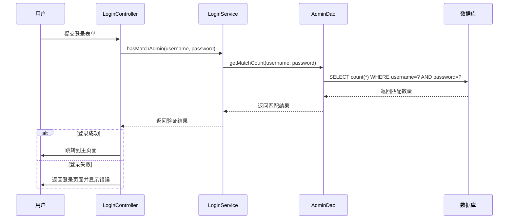
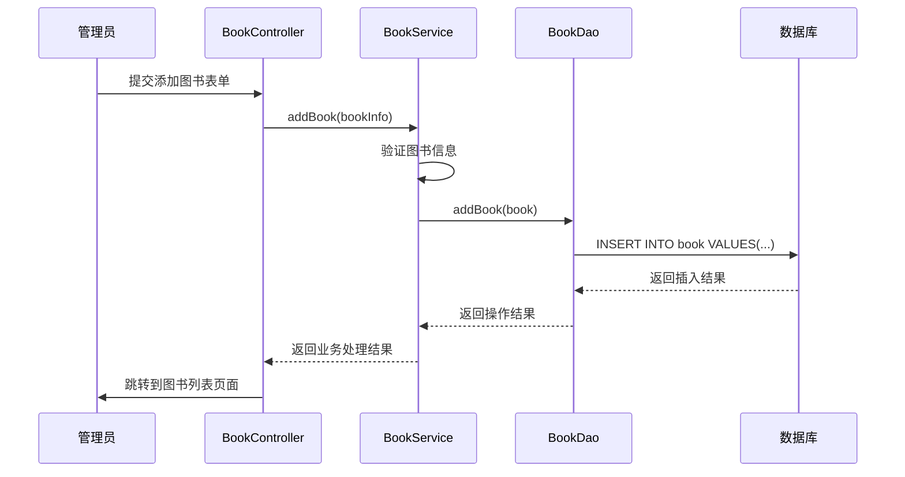
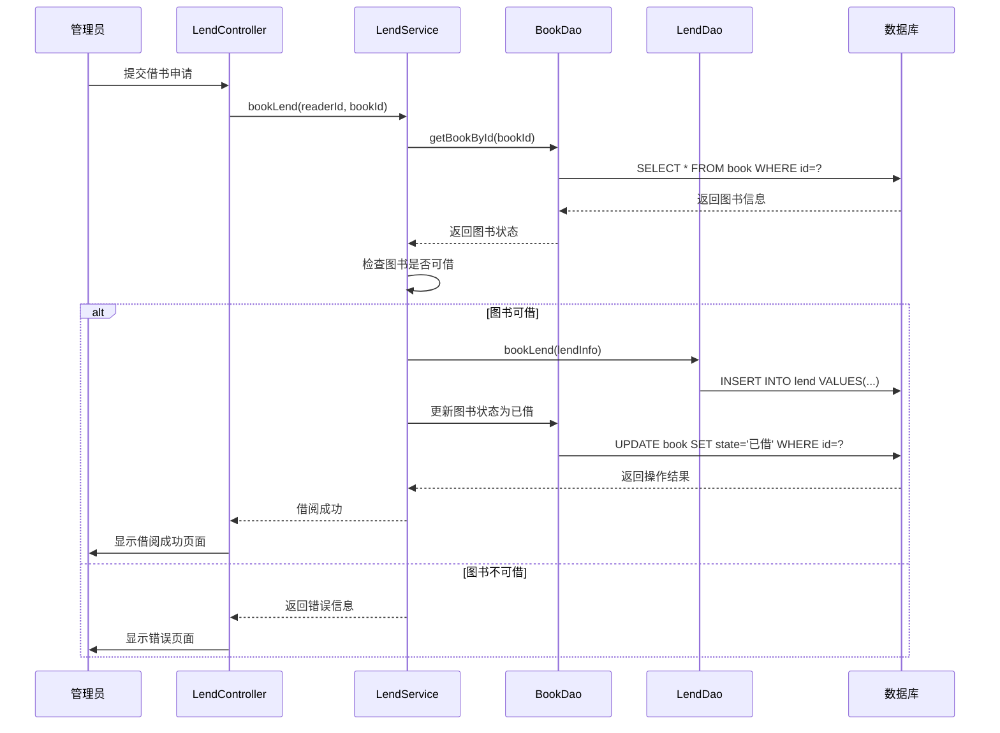
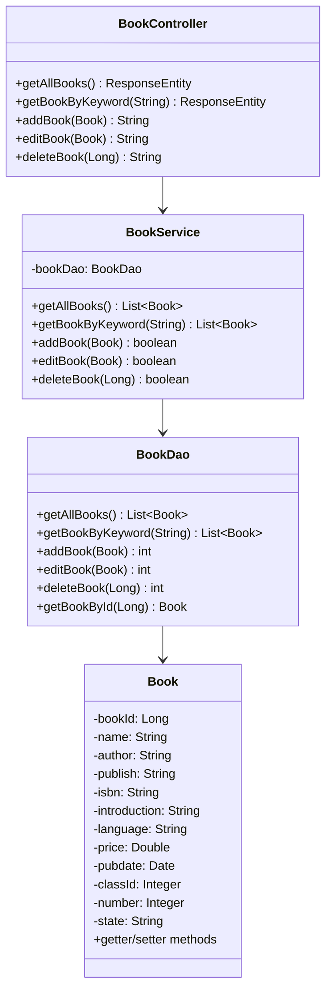
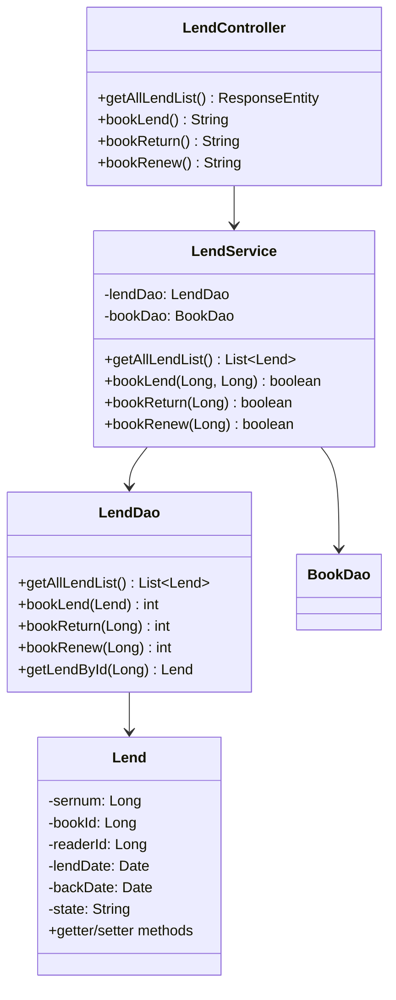
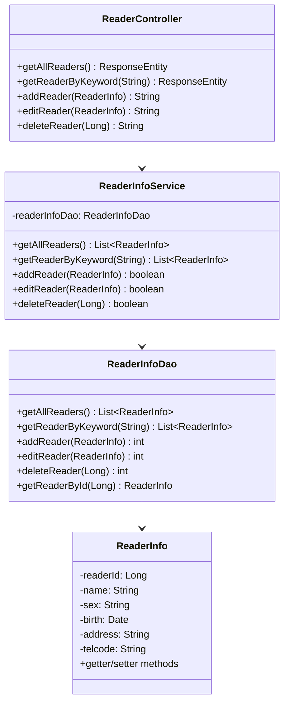

# 软件详细设计说明书-第三章

## 第三章 软件详细设计

### 3.1 前端设计

#### 3.1.1 公共配置的设计

##### 静态资源配置

**CSS 样式库配置**
- Bootstrap 3.3.7：提供响应式布局和UI组件
  - 位置：`/webapp/static/css/bootstrap.min.css`
  - 功能：基础样式框架、栅格系统、表单组件、按钮样式
  
- 自定义样式：
  - 位置：`/webapp/static/css/style.css`
  - 功能：项目特定样式定制、主题色彩、布局调整

**JavaScript 库配置**
- jQuery 3.4.1：DOM操作和事件处理
  - 位置：`/webapp/static/js/jquery-3.4.1.min.js`
  - 功能：表单验证、异步请求、DOM操作

- Bootstrap JavaScript：
  - 位置：`/webapp/static/js/bootstrap.min.js`
  - 功能：模态框、下拉菜单、导航栏交互

**公共组件模板**
```jsp
<!-- 页面头部模板 -->
<div class="navbar navbar-default navbar-fixed-top">
    <div class="container">
        <div class="navbar-header">
            <a class="navbar-brand" href="#">图书管理系统</a>
        </div>
        <div class="navbar-collapse collapse">
            <ul class="nav navbar-nav navbar-right">
                <li><a href="logout">退出登录</a></li>
            </ul>
        </div>
    </div>
</div>
```

**全局配置设置**
- 字符编码：UTF-8
- 响应式断点：Bootstrap标准断点（xs, sm, md, lg）
- 表单验证规则：客户端jQuery验证 + 服务端Spring Validation
- 错误处理：统一错误页面跳转机制

#### 3.1.2 各个视图的设计

##### 3.1.2.1 登录视图设计

**界面图**
```
┌─────────────────────────────────────┐
│           图书管理系统登录           │
├─────────────────────────────────────┤
│  用户名: [________________]         │
│  密码:   [________________]         │
│         [登录] [重置]               │
└─────────────────────────────────────┘
```

**视图文件**：`login.jsp`

**界面类流**
```
用户访问 → 显示登录页面 → 输入凭据 → 前端验证 → 提交表单 → 后端验证 → 登录成功/失败
```

**数据属性和方法设计**
```javascript
// 登录表单验证
function validateLoginForm() {
    var username = $("#username").val();
    var password = $("#password").val();
    
    if(username == "" || password == "") {
        alert("用户名和密码不能为空");
        return false;
    }
    return true;
}

// 表单提交处理
$("#loginForm").submit(function(e) {
    return validateLoginForm();
});
```

**初始化设置**
- 页面加载时焦点设置到用户名输入框
- 表单字段的默认值清空
- 错误信息显示区域初始化为隐藏状态

##### 3.1.2.2 管理员主界面视图设计

**界面图**
```
┌─────────────────────────────────────────────────┐
│  导航栏: 图书管理系统 | 欢迎XXX | 退出登录        │
├─────────────────────────────────────────────────┤
│ 侧边栏:          │     主内容区域               │
│ - 图书管理       │  ┌─────────────────────────┐  │
│ - 读者管理       │  │     功能模块内容         │  │
│ - 借阅管理       │  │                         │  │
│ - 系统统计       │  │                         │  │
│                 │  └─────────────────────────┘  │
└─────────────────────────────────────────────────┘
```

**视图文件**：`admin_main.jsp`

**界面类流**
```
登录成功 → 加载主界面 → 显示导航栏 → 加载侧边栏菜单 → 默认显示统计信息
```

**数据属性和方法设计**
```javascript
// 菜单切换功能
function switchMenu(menuItem) {
    $(".menu-item").removeClass("active");
    $(menuItem).addClass("active");
}

// 动态加载内容区域
function loadContent(url) {
    $("#main-content").load(url);
}
```

##### 3.1.2.3 图书管理视图设计

**界面图**
```
┌─────────────────────────────────────────────────┐
│              图书信息管理                        │
├─────────────────────────────────────────────────┤
│ [添加图书] [搜索: ____________] [查询]           │
├─────────────────────────────────────────────────┤
│ 图书ID | 书名 | 作者 | 出版社 | 状态 | 操作      │
│ 001   | Java编程 | 张三 | 人民邮电 | 可借 | 编辑删除│
│ 002   | Python入门| 李四 | 机械工业 | 已借 | 编辑删除│
└─────────────────────────────────────────────────┘
```

**视图文件**：`book_manage.jsp`、`book_add.jsp`、`book_edit.jsp`

**界面类流**
```
点击图书管理 → 加载图书列表 → 显示搜索框和操作按钮 → 用户操作（添加/编辑/删除/搜索）
```

**数据属性和方法设计**
```javascript
// 图书搜索功能
function searchBooks() {
    var keyword = $("#searchKeyword").val();
    window.location.href = "book_search?keyword=" + encodeURIComponent(keyword);
}

// 删除图书确认
function deleteBook(bookId) {
    if(confirm("确定要删除这本图书吗？")) {
        window.location.href = "book_delete?bookId=" + bookId;
    }
}
```

##### 3.1.2.4 读者管理视图设计

**界面图**
```
┌─────────────────────────────────────────────────┐
│              读者信息管理                        │
├─────────────────────────────────────────────────┤
│ [添加读者] [搜索: ____________] [查询]           │
├─────────────────────────────────────────────────┤
│ 读者卡号 | 姓名 | 性别 | 电话 | 状态 | 操作      │
│ R001    | 王五 | 男   | 138xx | 正常 | 编辑删除  │
│ R002    | 赵六 | 女   | 139xx | 冻结 | 编辑删除  │
└─────────────────────────────────────────────────┘
```

**视图文件**：`reader_manage.jsp`、`reader_add.jsp`、`reader_edit.jsp`

##### 3.1.2.5 借阅管理视图设计

**界面图**
```
┌─────────────────────────────────────────────────┐
│              借阅信息管理                        │
├─────────────────────────────────────────────────┤
│ [借书登记] [还书登记] [搜索: ______] [查询]      │
├─────────────────────────────────────────────────┤
│ 借阅ID | 读者 | 图书 | 借书日期 | 应还日期 | 操作 │
│ L001  | 王五 | Java编程 | 2024-01-01 | 2024-02-01 | 续借还书│
└─────────────────────────────────────────────────┘
```

**视图文件**：`lend_manage.jsp`、`book_lend.jsp`、`book_return.jsp`

### 3.2 后端设计

#### 3.2.1 控制接口层的设计

**控制器组件类列表**

1. **LoginController（登录控制器）**
   - 类名：`com.book.controller.LoginController`
   - 功能：处理用户登录、登出、权限验证
   - 主要方法：
     - `toLogin()`: 跳转到登录页面
     - `login()`: 处理登录请求
     - `logout()`: 处理登出请求

2. **BookController（图书管理控制器）**
   - 类名：`com.book.controller.BookController`
   - 功能：图书信息的增删改查操作
   - 主要方法：
     - `getAllBooks()`: 获取所有图书列表
     - `getBookByKeyword()`: 根据关键字搜索图书
     - `addBook()`: 添加新图书
     - `editBook()`: 编辑图书信息
     - `deleteBook()`: 删除图书

3. **ReaderController（读者管理控制器）**
   - 类名：`com.book.controller.ReaderController`
   - 功能：读者信息管理和读者卡管理
   - 主要方法：
     - `getAllReaders()`: 获取所有读者信息
     - `getReaderByKeyword()`: 搜索读者
     - `addReader()`: 添加新读者
     - `editReader()`: 编辑读者信息
     - `deleteReader()`: 删除读者

4. **LendController（借阅管理控制器）**
   - 类名：`com.book.controller.LendController`
   - 功能：处理图书借阅、归还、续借操作
   - 主要方法：
     - `getAllLendList()`: 获取借阅记录列表
     - `bookLend()`: 图书借阅登记
     - `bookReturn()`: 图书归还处理
     - `bookRenew()`: 图书续借处理

#### 3.2.2 应用服务层的设计

**服务组件类列表**

1. **LoginService（登录服务）**
   - 类名：`com.book.service.LoginService`
   - 功能：用户身份验证和会话管理
   - 主要方法：
     - `hasMatchAdmin()`: 管理员身份验证
     - `hasMatchReader()`: 读者身份验证

2. **BookService（图书服务）**
   - 类名：`com.book.service.BookService`
   - 功能：图书业务逻辑处理
   - 主要方法：
     - `getAllBooks()`: 获取图书列表业务逻辑
     - `getBookByKeyword()`: 图书搜索业务逻辑
     - `addBook()`: 添加图书业务验证
     - `editBook()`: 编辑图书业务验证
     - `deleteBook()`: 删除图书业务验证

3. **ReaderInfoService（读者信息服务）**
   - 类名：`com.book.service.ReaderInfoService`
   - 功能：读者信息业务逻辑
   - 主要方法：
     - `getAllReaders()`: 读者列表业务逻辑
     - `getReaderByKeyword()`: 读者搜索业务逻辑
     - `addReader()`: 添加读者业务验证
     - `editReader()`: 编辑读者业务验证
     - `deleteReader()`: 删除读者业务验证

4. **ReaderCardService（读者卡服务）**
   - 类名：`com.book.service.ReaderCardService`
   - 功能：读者卡管理业务逻辑
   - 主要方法：
     - `getAllReaderCards()`: 获取读者卡列表
     - `addReaderCard()`: 添加读者卡
     - `editReaderCard()`: 编辑读者卡信息

5. **LendService（借阅服务）**
   - 类名：`com.book.service.LendService`
   - 功能：借阅业务逻辑处理
   - 主要方法：
     - `getAllLendList()`: 借阅记录业务逻辑
     - `bookLend()`: 借书业务逻辑验证
     - `bookReturn()`: 还书业务逻辑处理
     - `bookRenew()`: 续借业务逻辑验证

#### 3.2.3 数据层的设计

**数据访问组件类列表**

1. **BookDao（图书数据访问对象）**
   - 类名：`com.book.dao.BookDao`
   - 功能：图书数据的CRUD操作
   - 主要方法：
     - `getAllBooks()`: 查询所有图书
     - `getBookByKeyword()`: 根据关键字查询图书
     - `addBook()`: 插入新图书记录
     - `editBook()`: 更新图书信息
     - `deleteBook()`: 删除图书记录
     - `getBookById()`: 根据ID查询图书

2. **ReaderInfoDao（读者信息数据访问对象）**
   - 类名：`com.book.dao.ReaderInfoDao`
   - 功能：读者信息数据操作
   - 主要方法：
     - `getAllReaders()`: 查询所有读者
     - `getReaderByKeyword()`: 根据关键字查询读者
     - `addReader()`: 插入新读者记录
     - `editReader()`: 更新读者信息
     - `deleteReader()`: 删除读者记录
     - `getReaderById()`: 根据ID查询读者

3. **ReaderCardDao（读者卡数据访问对象）**
   - 类名：`com.book.dao.ReaderCardDao`
   - 功能：读者卡数据操作
   - 主要方法：
     - `getAllReaderCards()`: 查询所有读者卡
     - `addReaderCard()`: 插入新读者卡记录
     - `editReaderCard()`: 更新读者卡信息
     - `deleteReaderCard()`: 删除读者卡记录
     - `getReaderCardById()`: 根据ID查询读者卡

4. **LendDao（借阅数据访问对象）**
   - 类名：`com.book.dao.LendDao`
   - 功能：借阅记录数据操作
   - 主要方法：
     - `getAllLendList()`: 查询所有借阅记录
     - `bookLend()`: 插入借阅记录
     - `bookReturn()`: 更新还书记录
     - `bookRenew()`: 更新续借记录
     - `getLendById()`: 根据ID查询借阅记录

5. **AdminDao（管理员数据访问对象）**
   - 类名：`com.book.dao.AdminDao`
   - 功能：管理员信息数据操作
   - 主要方法：
     - `getMatchCount()`: 验证管理员登录凭据
     - `getAdminById()`: 根据ID查询管理员信息

#### 3.2.4 用例设计

##### 3.2.4.1 用户登录用例顺序图



##### 3.2.4.2 图书添加用例顺序图



##### 3.2.4.3 图书借阅用例顺序图



##### 3.2.4.4 设计类图

**图书管理模块设计类图**



**借阅管理模块设计类图**



**用户管理模块设计类图**



### 3.3 数据库设计优化

基于现有的数据库结构，建议以下优化：

1. **索引优化**
   - 在book表的name、author字段上创建索引提高搜索性能
   - 在lend表的readerId、bookId字段上创建组合索引

2. **数据完整性约束**
   - 添加外键约束确保数据一致性
   - 添加检查约束验证数据有效性

3. **性能优化**
   - 实现数据库连接池管理
   - 添加查询结果缓存机制

### 3.4 安全设计

1. **身份认证**
   - Session机制管理用户登录状态
   - 密码加密存储（建议使用BCrypt）

2. **权限控制**
   - 基于角色的访问控制（管理员/读者）
   - URL访问权限验证

3. **数据安全**
   - SQL注入防护（使用PreparedStatement）
   - XSS攻击防护（输入验证和输出编码）

---

*本章详细设计了图书管理系统的前端界面设计和后端架构设计，为系统开发提供了完整的技术实现方案。*
